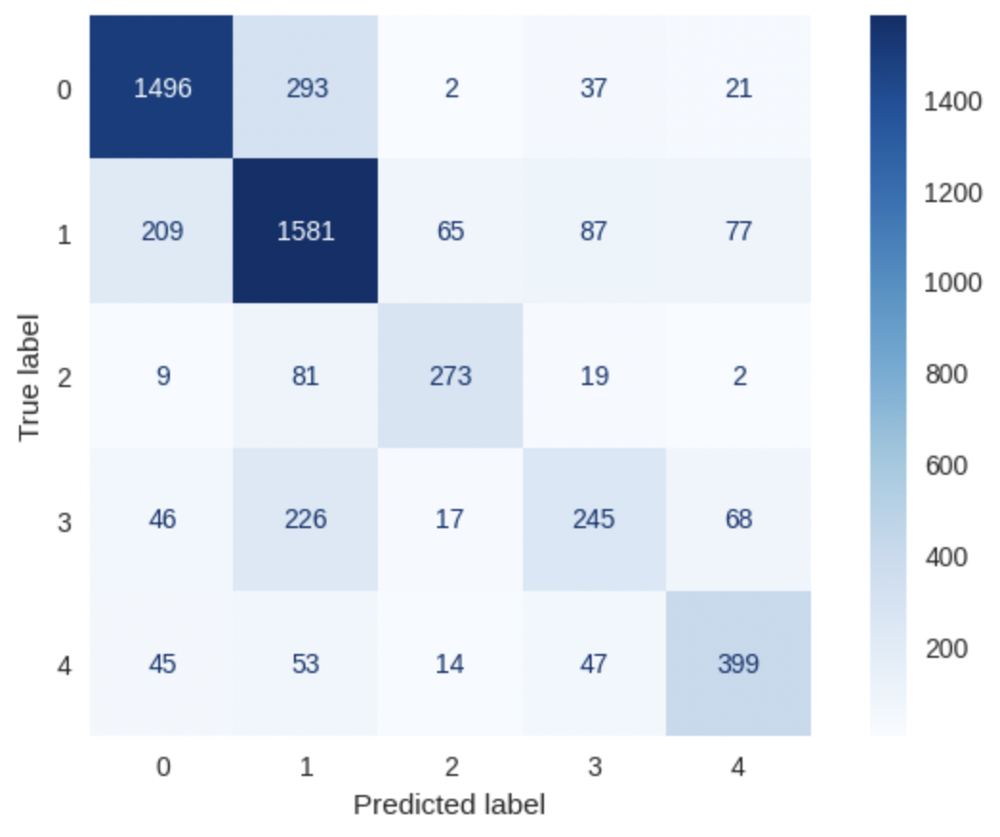

# Weather Status Predictor From Images

## About the Project

predicting weather status has been a rich field to apply the technology of machine
learning (ML) and deep learning (DL) along with Convolutional Neural Network (CNN). There are so many examples of
projects with various level of accuracy and advance that predict or classify the weather status from given
satellite images in visible light, infrared ranges, or other light spectra. However, for this project I will do a
similar approach but with images taken with smart phones or digital cameras of a landscape views, then try to
predict the appearing weather status in that appearance. I used different algorithms for ML using only two classes, that is, *sunny* and *cloudy*. For CNN I used the entire dataset of more than 18K images with 5-class
weather status. Each image is 200x200 pixels with 3-channel colors.

## Online Predictor

To predict an image [TRY NOW](https://web-production-df4e.up.railway.app/)

The final models that I reached are deployed on Heroku [Visit](https://dsi-weather-predictor.herokuapp.com)
you can predict on binary classification or with 5-class classification.

## Data

### About

I wanted to collect real fresh outdoors images with fire classes in a part of Misk Foundation Data Science Immersive project. With MS Bing API I collected and cleaned up to 1500 images for all classes. Further, I collected data from four kaggle datasets, their credits are below.

### Dictionary

You can find the dataset in [Kaggle](https://www.kaggle.com/datasets/ammaralfaifi/5class-weather-status-image-classification), where more details about the data is given.

### Data Summary

| Class   |   Folder  |   Images Count  |
---       | ---       | ---             |
| Sunny   | sunny     | 6702             |
| Cloudy  | cloudy    | 6274             |
| Foggy   | foggy     | 1261             |
| Rainy   | rainy     | 1927             |
| Snowy   | snowy     | 1875             |
| Total   | -         | 18039            |
---

### Sources

1 - Manually from Bing API
2 - https://www.kaggle.com/datasets/jagadeesh23/weather-classification
3 - https://www.kaggle.com/datasets/polavr/twoclass-weather-classification
4 - https://www.kaggle.com/datasets/jehanbhathena/weather-dataset
5 - https://www.kaggle.com/datasets/pratik2901/multiclass-weather-dataset
